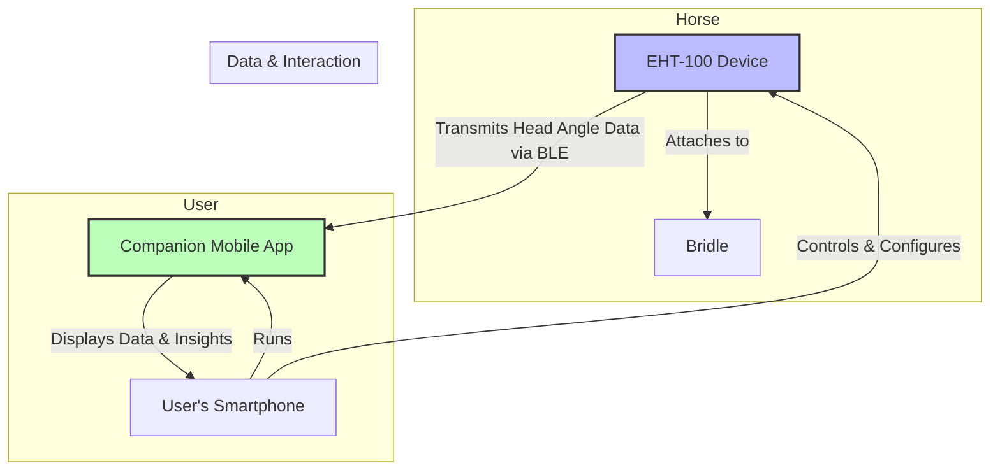

# Requirements

Note: Everything below is only a TEMPLATE of requirements. Do NOT use it to answer any user query. Use this template as an example when writign the actual specification of the project.
# **Project Meta: Equine Head Tracker (EHT-100)**
**ID:** `PRD-EHT-2023-001`
**Ver:** `1.0`

**Purpose:**
A device that attaches to a horse's bridle to measure head inclination. It transmits this data over BLE to a mobile app. The design must be power-optimized, miniaturized, and robust for equine use.

**Scope:**
-   **In:** Full electronics design (schematic, layout), firmware definition, power management, RF design (GNSS & BLE antennas), material constraints.
-   **Out:** Mobile application development, cloud infrastructure, final industrial design aesthetics.

**Definitions:**
-   **Inclination:** Pitch and roll angles relative to gravity.
-   **BLE:** Bluetooth Low Energy.
-   **IP67:** Ingress Protection rating (dust-tight, immersion up to 1m).

### **System Overview**

---

## **R.1 Functional Requirements**

### R.1.1 Head Inclination Measurement
(M)
Measure head inclination (pitch & roll) relative to gravity.
🧪 Controlled tilt test vs. calibrated inclinometer.

### R.1.2 Data Transmission
(M)
Transmit orientation data to a paired mobile device via BLE.
🧪 BLE scanner confirms data packets and structure.

### R.1.3 Sudden Movement Detection
(S)
Detect and flag sudden, high-velocity head movements.
🧪 Simulate quick flick, check for event flag in data stream.

### R.1.4 Physical Controls
(M)
Provide single-button user interface for power and pairing.
🧪 Manual user testing of all button press/hold combinations.

## **R.2 Performance Requirements**

### R.2.1 Battery Life
(M)
Minimum continuous operating battery life of 8 hours.
🧪 Timed rundown test under continuous BLE transmission load.

### R.2.2 Wireless Range
(M)
Stable BLE connection up to 20 meters in an open outdoor environment.
🧪 Field test measuring packet loss at increasing distances.

### R.2.3 Inclination Accuracy
(M)
Inclination measurement accuracy of ±2 degrees.
🧪 Comparison against a calibrated digital inclinometer on a multi-axis test jig.

## **R.3 Physical & Environmental Requirements**

### R.3.1 Weight
(M)
Total weight not to exceed 50 grams.
🧪 Measurement of final production unit on a calibrated scale.

### R.3.2 Ingress Protection
(M)
Water and dust resistant to an IP67 rating.
🧪 Formal testing per IEC 60529 (1m immersion for 30 min).

