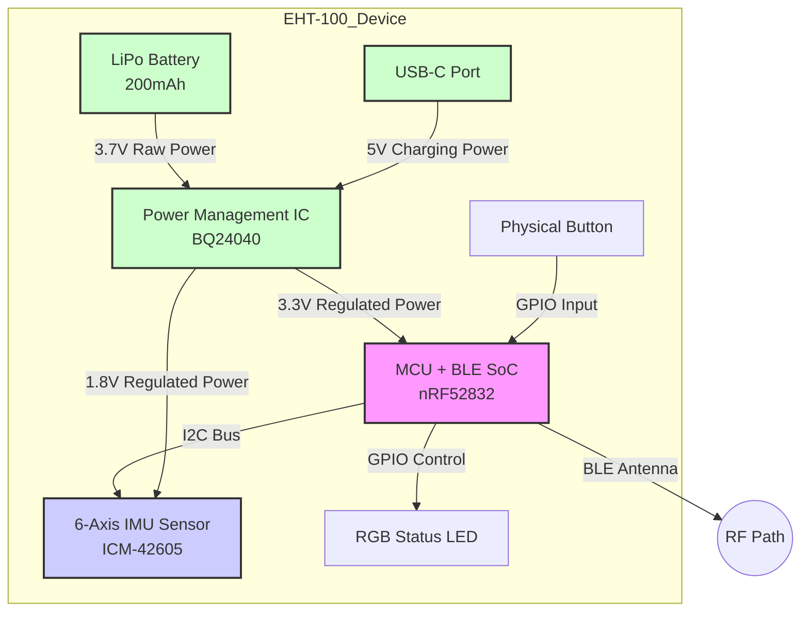

# Specifications

Note: Everything below is only a TEMPLATE of requirements. Do NOT use it to answer any user query. Use this template as an example when writign the actual specification of the project.
# **Project Meta: Equine Head Tracker (EHT-100)**
**ID:** `SPEC-EHT-2023-001`
**Ver:** `1.0`
**Fulfills:** `PRD-EHT-2023-001 v1.0`

## **System Architecture**
This diagram details the primary hardware components and their interconnections.

---

## **S.1 Hardware Specifications**

### S.1.1 Microcontroller
⚙️ Nordic Semiconductor nRF52832 SoC.
→ Low power, mature BLE stack, sufficient processing for sensor fusion.
✓ R.1.2, R.2.1, R.2.2

### S.1.2 IMU Sensor
⚙️ TDK InvenSense ICM-42605.
→ High accuracy (16-bit), low power, onboard Digital Motion Processor.
✓ R.1.1, R.1.3, R.2.3

### S.1.3 Battery
⚙️ 3.7V 200mAh LiPo.
→ Balances physical size/weight with 8-hour energy budget (<25mA avg draw).
✓ R.2.1, R.3.1

### S.1.4 Power Management IC
⚙️ Texas Instruments BQ24040.
→ Single-chip charger with power path for circuit simplicity and safety.
✓ R.4.2, R.4.3

## **S.2 Firmware & Software Specifications**

### S.2.1 Sensor Fusion
`</>` Madgwick filter running on nRF52832.
It generates stable orientation quaternions, which are then converted to Euler angles (pitch, roll) for transmission.
✓ R.1.1, R.2.3

### S.2.2 BLE Profile
`</>` Custom GATT Service with an "Orientation" Characteristic (UUID: `0x2A6E`).
The payload is 4 bytes (2 for Pitch, 2 for Roll) in Q1.14 fixed-point format.
Update Interval: 100ms (10 Hz).
✓ R.1.2, R.2.4

### S.2.3 Event Detection
`</>` The firmware monitors raw gyroscope angular velocity.
If velocity exceeds a threshold of 200 deg/sec, a flag bit is set in the next BLE packet.
✓ R.1.3

## **S.3 Mechanical & Environmental Specifications**

### S.3.1 Enclosure Materials
⚙️ Main Body: Polycarbonate (PC).
⚙️ Overmold/Strap: Silicone (Shore 60A).
→ PC for impact resistance; Silicone for non-toxicity and flexibility.
✓ R.3.4, R.3.5

### S.3.2 Sealing Method
`</>` Ultrasonic welding for the two PC enclosure halves.
An integrated silicone plug on the overmold protects the USB-C port.
→ Provides a robust, glue-free seal for water ingress protection.
✓ R.3.2
