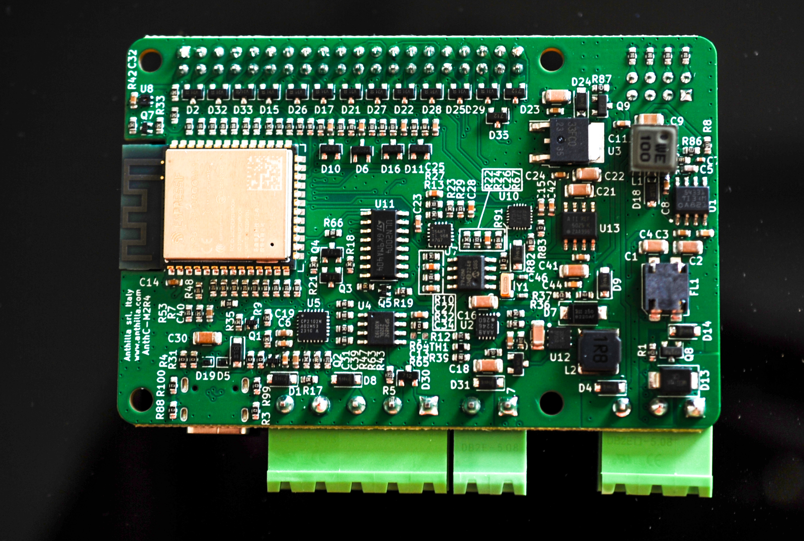

# AnthC - Anthilla Controller Board

## Description

The Anthilla Controller Board is a flexible controller for IoT projects. It can be easily adapted for different needs. The board has the Rasperry-pi form factor to fast the integration.

## Features

- Extended range temperature
- Input power: 7V - 28V. The board can be powered by just powering 5V area.
- 4 Digital inputs
- 6 Open collector outputs
- 4 Analog inputs (16 bit ADC) or 4-20mA inputs switchable (multiplexed)
- RS485 communication
- Real time clock
- Rechargeable LiPo battery
- I2C and SPI communication
- USB-C port

## Open Source

The board M2-R3 got the Open Source Hardware Certification under the UID IT000013

https://certification.oshwa.org/it000013.html

The board M2-R4 got the Open Source Hardware Certification under the UID IT000014

https://certification.oshwa.org/it000014.html

## Articles

The board has been mentioned in the following articles:

- [Building and Certifying an Open-Source IoT Controller, Part 1](https://www.allaboutcircuits.com/projects/building-and-certifying-an-open-source-iot-controller-part-1/)
- [Building and Certifying an Open-Source IoT Controller, Part 2: Open-Source Certification](https://www.allaboutcircuits.com/projects/building-and-certifying-an-open-source-iot-controller-part-2-open-source-certification/)
- [Building and Certifying an Open-Source IoT Controller, Part 3: Manufacturing and Testing](https://www.allaboutcircuits.com/projects/building-and-certifying-an-open-source-iot-controller-part-3-manufacturing-and-testing/)
- [Building and Certifying an Open-Source IoT Controller, Part 4: Regulatory Compliance](https://www.allaboutcircuits.com/projects/building-and-certifying-an-open-source-iot-controller-part-4-regulatory-compliance/)

## Hackaday page
- [Hackaday Project Page](https://hackaday.io/project/194974-anthilla-controller-open-source-iot-controller)

## Last changes

The version M2-R4 has the following differences

- The PCB stackup is Signal + Power / GND / GND / Signal + Power
- Battery control circuit: replaced the bipolar transistor by a MOSFET

## Roadmap

The version M2-R3 is stable. The next steps are the following:

- Manufacture and test the M2-R4
- Perform EMC tests
- Generate the CE certificate
- Write the documentation for the final user
- Develop a base Firmware

## Photos

