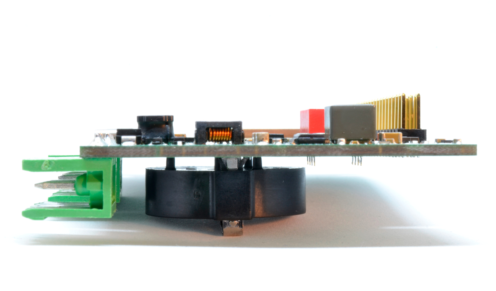
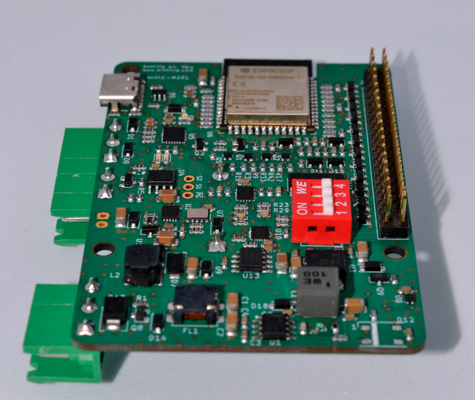

# AnthC - Anthilla Controller Board

## Description

The Anthilla Controller Board is a flexible controller for IoT projects. It can be easily adapted for different needs. The board has the Rasperry-pi form factor to fast the integration.

## Features

- Extended range temperature
- Input power: 7V - 28V. The board can be powered by just powering 5V area.
- 4 Digital inputs
- 6 Open collector outputs
- 4 Analog inputs (16 bit ADC) or 4-20mA inputs switchable (multiplexed)
- RS485 communication
- Real time clock
- Rechargeable LiPo battery
- I2C and SPI communication
- RGB Led
- USB-C port

## Roadmap

The version M2-R2 is stable. The next steps are the following:

- Improve its manufacturability and testing
- Get the Open Source Hardware certification (OSHW)
- Perform EMC tests
- Generate the CE marking certificate

## Photos

