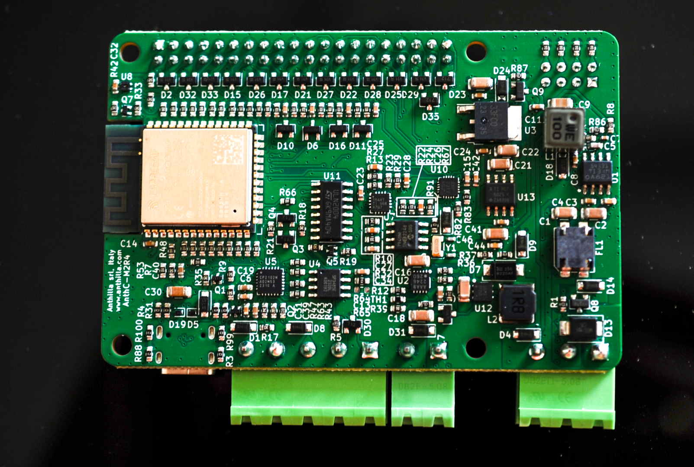

# AnthC — Open-Source ESP32 Industrial IoT Controller

AnthC (Anthilla Controller) is an ESP32-based controller for industrial and field IoT: read 4–20 mA sensors, talk Modbus over RS485, switch loads, and keep running on battery when the supply drops. Raspberry Pi footprint, so it drops into existing enclosures and DIN-rail mounts.
AnthC (Anthilla Controller) is an ESP32-based controller for industrial and field IoT: read 4–20 mA sensors, talk Modbus over RS485, switch loads, and keep running on battery when the supply drops. Raspberry Pi footprint, so it drops into existing enclosures and DIN-rail mounts.

**[Buy on Elecrow](https://www.elecrow.com/anthc-controller.html)** · **[Download M2-R5 files](https://github.com/Anthilla/AnthC/releases/tag/M2-R5)** · [Hackaday project](https://hackaday.io/project/194974-anthilla-controller-open-source-iot-controller) · [Design articles](#articles)

## Key specs

| | |
|---|---|
| MCU | ESP32-S3-WROOM-1: Dual-Core 32bit microprocessor. WiFi (802.11b/g/n) and Bluetooth. On board antenna |
| Power input | 7–28 V DC or 5 V direct through USB|
| Battery backup | Rechargeable LiPo, on-board charger |
| Digital inputs | 4 × Digital signals [0-3.3V] |
| Outputs | 6 × open collector (ULN2003), 500mA per channel |
| Analog inputs | 4 × 16-bit ADC, each switchable 0–5V V or 4–20 mA (multiplexed) |
| Fieldbus | RS485 half-duplex (SP3485EN), Modbus RTU capable. On-board termination |
| RTC | MCP7940N, CR2032 coin cell |
| Expansion | I2C, SPI |
| USB | USB-C (programming + 5 V power) |
| Form factor | Raspberry Pi footprint, 85 × 56 mm |

## Getting started

1. Power the board from USB-C or 7–28 V on the J5 terminal.
2. Install [ESP-IDF](https://docs.espressif.com/projects/esp-idf/) or the Arduino ESP32 core.
3. Select board ESP32-S3-dev and flash an example 

## Files

**For manufacturing or evaluation, use the [Releases](https://github.com/Anthilla/AnthC/releases)** — each hardware revision ships a fabrication zip (Gerbers, drill), an assembly zip (BOM with MPNs, placement), the schematic as PDF and a STEP model.

| Path | Content |
|---|---|
| `AnthC/` | KiCad project (requires **KiCad 10** or later) and project libraries in `AnthC/lib/` |
| `AnthC/Doc/Schematics/` | Schematic PDFs per revision |
| `AnthC/Doc/Manufacturing/` | Gerbers and drill files per revision (older revisions in `Archive/`) |
| `AnthC/Doc/Assembly/` | BOM and pick-and-place per revision |
| `AnthC/Doc/STEP/` | 3D models |
| `AnthC/Doc/Certifications/` | OSHWA certification marks |
| `Marketing/` | Logos and photos |

## Hardware revisions

The revision is printed on the silkscreen (e.g. `AnthC-M2R5`).

| Revision | Status | Changes |
|---|---|---|
| [M2-R5](https://github.com/Anthilla/AnthC/releases/tag/M2-R5) | **Current** | USB-C fixed · ULN2004 replaced by ULN2003 |
| M2-R4 | Superseded · OSHWA IT000014 | Stackup Signal+Power / GND / GND / Signal+Power · Battery control: BJT replaced by MOSFET |
| M2-R3 | Superseded · OSHWA IT000013 | First certified release |

## Certification and compliance

- **Open source hardware:** M2-R3 and M2-R4 are certified by OSHWA (IT000013, IT000014). M2-R5 certification is pending.
- **EMC / CE:** not yet tested. Be aware the end product manufacturer is responsible for its own conformity assessment
- **Battery:** LiPo cells must not be charged below 0 °C or above 45 °C, regardless of the board's operating range

## Roadmap

- [ ] User documentation
- [ ] Base firmware and examples
- [ ] Replace photos
- [ ] EMC pre-compliance test plan
- [ ] EMC tests

## Articles

All About Circuits — *Building and Certifying an Open-Source IoT Controller*:

- [Part 1: Design](https://www.allaboutcircuits.com/projects/building-and-certifying-an-open-source-iot-controller-part-1/)
- [Part 2: Open-Source Certification](https://www.allaboutcircuits.com/projects/building-and-certifying-an-open-source-iot-controller-part-2-open-source-certification/)
- [Part 3: Manufacturing and Testing](https://www.allaboutcircuits.com/projects/building-and-certifying-an-open-source-iot-controller-part-3-manufacturing-and-testing/)
- [Part 4: Regulatory Compliance](https://www.allaboutcircuits.com/projects/building-and-certifying-an-open-source-iot-controller-part-4-regulatory-compliance/)

## Support

- Bugs and hardware questions: [GitHub Issues](https://github.com/Anthilla/AnthC/issues)
- Orders and shipping: Elecrow
- Custom variants and integration: projects@anthilla.com

## License

- **Hardware:** [CERN Open Hardware Licence v2 — Weakly Reciprocal (CERN-OHL-W-2.0)](LICENSE%20-%20Hardware)

## Photos

M2-R4 shown; M2-R5 is visually near-identical (They will be replaced)

